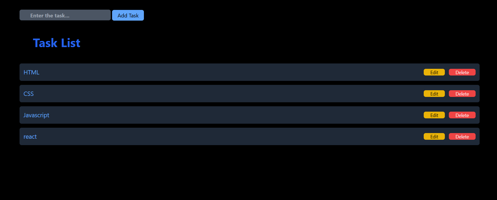

# 📝 To-Do List CRUD App (JavaScript)

A simple **To-Do List application** built using **HTML, Tailwind CSS, and Vanilla JavaScript**.  
This project demonstrates basic **CRUD operations**: Create, Read, Update, and Delete tasks.

---

## 🚀 Features

- ➕ Add new tasks
- ✏️ Edit existing tasks
- 🗑️ Delete tasks
- ⚠️ Input validation (prevents empty tasks)
- 🎨 Clean UI using Tailwind CSS
- 🧠 Beginner-friendly JavaScript logic

---

## 🛠️ Technologies Used

- **HTML**
- **Tailwind CSS**
- **JavaScript (DOM Manipulation)**

---

## 📂 Project Structure

📁 todo-app
┣ 📄 index.html
┣ 📄 script.js
┗ 📄 README.md

yaml
Copy code

---

## 📌 How It Works

1. User enters a task in the input field
2. Clicking **Add** creates a new task
3. Each task has:
   - **Edit** button → updates task using `prompt()`
   - **Delete** button → removes task from list
4. Tasks are dynamically added to the DOM

---

## Demo

[live@](https://to-dolistst01.netlify.app/)

## 🧩 CRUD Breakdown

| Operation | Description |
|---------|-------------|
| Create | Add new task |
| Read | Display task list |
| Update | Edit task text |
| Delete | Remove task |

---

## 🧪 How to Run

1. Download or clone the repository
2. Open `index.html` in your browser
3. Start adding tasks 🎉

---

## 📈 Future Improvements

- ✅ Mark task as completed
- 💾 Save tasks using `localStorage`
- 🔍 Search tasks
- 📱 Mobile responsiveness
- 🌙 Dark/Light mode

---

## 👩‍💻 Author

**Archana K R**  
Beginner JavaScript Developer 🚀

---

## 📜 License

This project is open-source and free to use.
If you want, I can also:

